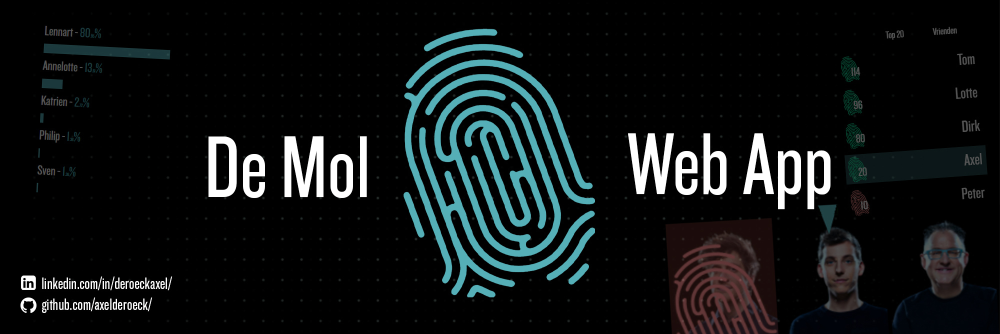

<!--  -->

## Background
This web app is based on a Belgian TV game show. The show revolves around a group of people earning as much money as possible with challenges, all while finding the 1 mole whose task is to sabotage the challenges. Every episode there is a test with questions about the mole. The candidate who has the weakest test result has to go home. The last 2 candidates have to fight for the best test result about the mole in order to win.

**De Mol** is owned by **[Woestijnvis](https://www.woestijnvis.be/producties/de-mol)**, **[GoPlay](https://www.goplay.be/)** and **[SBSBelgium](https://www.sbsbelgium.be/)**.

## The Web App

### Goal

The point of this web app is to play along with the tv show. You start out with **10** points and u have to submit these points to the candidates u find the most suspicious. 

// gif vote page

After the episode airs, you will get a screen that displays your results.
If you voted on a candidate that had to go home this episode, you will have a **red screen** and lose those points. However if u voted correctly u will get a **green screen** and those points will be doubled.

!!! example Example
    This is what I voted.
    - Lennart: 8pts
    - Dami: 2pts
    
    Dami had to go home this episode, this means I lose those 2 points.
    But my points on Lennart are still correct, that means I get double the amount back = 16pts total.

!!! question What screen do I get if I am both correct and wrong like in the example above?
    You will still get a red screen, but only lose the wrong points.

!!! question What if I lose all my points?
    If you happen to lose all your points, you will receive another 10 points to start again.

// gif screen page

### Social

// profile page image

Looking for the mole alone is no fun. That's why u can also add friends and groups to the search. 

// friends and groups gifs

On the scores page u can compare your scores with everyone and see who wins at the end.

// scores gif

>[!WARNING]
>This is a warning test
